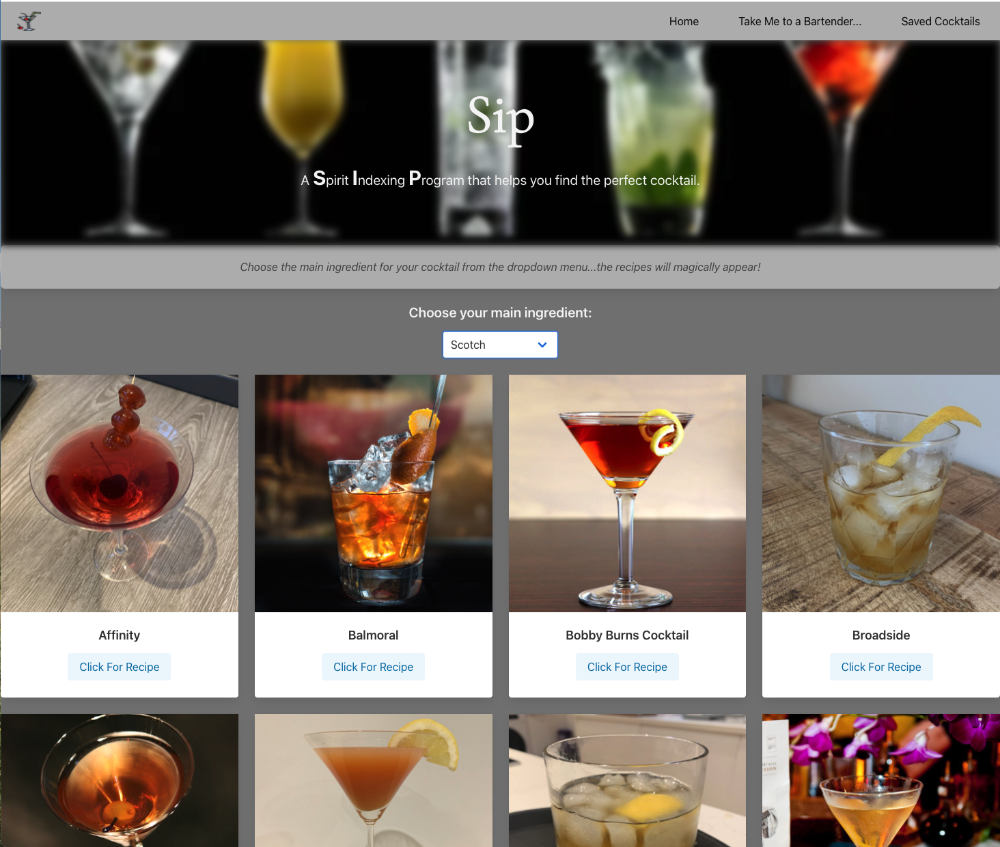

## SIP Web Application

SIP, or Spirit Index Program, is a web application that utilizes TheCocktailDB API and Yelp Fusion API to search for cocktails using a base liquor (vodka, rum, gin, whisky, etc.) as well as searching for local bars that serve cocktails if you don't feel like making a cocktail at home!

The landing page is the cocktail search page. Using a dropdown to select the base liquor, results are loaded from TheCocktailDB API and displayed with the cocktail name and a picture of the cocktail. When you click on a cocktail, a modal appears containing the cocktail ingredients and mixing instructions. There is also an option to save a selected cocktail to your local storage to access again later.

A link to a "cocktail locator" page will bring you to a similar page, but with an input for a zipcode so that users can enter their zipcode and search for bars in the area utilizing the Yelp API. This page brings up a list of results including the name of the bar and its address

## Features

Search database for cocktails based on a liquor
View cocktail name and picture of cocktail
View cocktail ingredients and mixing instructions
Save viewed cocktails to look at later
Search for local bars using zipcode
View name, address, and phone numbers of bars in zipcode

### Livepage Link
[Build-A-Cocktail Page](https://danshoup.github.io/build-a-cocktail/)

### SIP Homepage Screenshot

### Resources

Bulma (https://bulma.io/)
TheCocktailDB API (https://www.thecocktaildb.com/)
Yelp Fusion API (https://www.yelp.com/developers/documentation/v3)

### Contributors

Daniel Schoup (github: danshoup)
Jamie Kuras (github: jkur16)
Curtis Drullinger (github: Curtisaurus)
Emily Tassoni (github: tassoni13)
